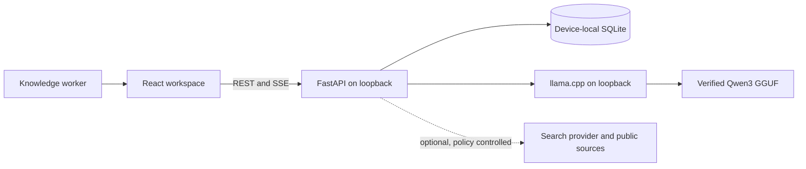

# Sovereign AI iBuddy

> A governed private-AI pilot reference for evaluating a path to sovereign capability.

[](https://github.com/shibinantony/sovereign_ai_ibuddy/actions/workflows/quality.yml)
[](https://github.com/shibinantony/sovereign_ai_ibuddy/actions/workflows/codeql.yml)
[](LICENSE)

## Executive proposition

Regulated and sensitive organizations need the productivity of generative AI without making confidential prompts, working data, and institutional knowledge dependent on an uncontrolled public service. Sovereign AI iBuddy demonstrates the smallest useful response: local model execution, device-local conversation history, explicit network controls, verifiable runtime assets, and optional evidence-backed web research.

The recommendation is to **approve a constrained workstation pilot using this reference implementation, not approve a production-regulated platform**. Use the pilot to prove value, workflow adoption, data handling, quality, and operating economics. Fund enterprise controls only when those gates pass.

| Decision field | Current position |
|---|---|
| Portfolio choice | Approve a constrained pilot; extend or build only after evidence |
| Appropriate scope | Internal research, drafting, summarization, and learning with approved data |
| Current deployment class | Single-user Windows reference implementation |
| Production status | Not approved for regulated or consequential decisions |
| Accountable pilot owner | Must be named by the adopting organization |
| Next decision | Scale, revise, or stop after the pilot scorecard is reviewed |

## The business problem

Knowledge workers in banking, financial services and insurance (BFSI), pharma, healthcare, government, legal, defence-adjacent, and other sensitive environments face four linked problems:

1. **Data exposure:** consumer AI can move prompts and context outside an approved trust boundary.
2. **Operational dependence:** cloud-only tools can be unavailable, blocked, costly, or unsuitable for jurisdiction-bound workloads.
3. **Uncontrolled adoption:** when approved options are absent, shadow AI grows faster than governance.
4. **Weak evidence:** a technically successful demo rarely proves business value, human adoption, model quality, auditability, or full lifecycle cost.

This repository addresses the first step: create a credible, inspectable private-AI baseline and make the gaps to production explicit.

## Where the pilot creates value

| Sector | Candidate pilot problem | Human remains accountable for | Explicitly out of scope today |
|---|---|---|---|
| BFSI | Policy research, analyst drafting, procedure explanation, non-customer knowledge support | Source validation, interpretation, approval, and any customer or market action | Credit, pricing, trading, AML/KYC disposition, claims, or customer eligibility decisions |
| Pharma | SOP discovery, controlled drafting, literature triage, quality-investigation preparation | Scientific review, GxP validation, medical judgment, release, and regulatory submission | Diagnosis, dosing, patient-specific advice, batch release, safety decisions, or autonomous regulated records |
| Sensitive enterprise | Internal knowledge work where cloud egress is restricted or undesirable | Classification, need-to-know access, factual review, and final action | Classified data, unattended actions, system-of-record updates, or high-impact decisions |

Detailed entry and exclusion criteria are in [Industry use cases](docs/INDUSTRY_USE_CASES.md).

## Value hypothesis and scale gates

No ROI figure in this repository is presented as fact. Baselines and targets belong to the adopting organization and must be validated with operational data.

| Dimension | Pilot question | Evidence required before scale |
|---|---|---|
| Value | Does the selected workflow become faster or more consistent? | Measured before/after cycle time, rework, throughput, or quality |
| Feasibility | Can approved hardware, data, skills, and support operate the service reliably? | Capacity results, support effort, failure data, and recovery test |
| Risk | Does the chosen boundary materially reduce unapproved data egress without creating unacceptable residual risk? | Data-flow review, control evidence, incidents, red-team results, and risk acceptance |
| Adoption | Do target users use it correctly in the real workflow? | Active-use and task-completion measures plus qualitative feedback |
| Economics | Does confidence-adjusted benefit exceed full lifecycle cost? | Hardware, engineering, assurance, support, energy, change, and exit costs |

Use the [pilot scorecard](governance/PILOT_SCORECARD.md) to set baselines, owners, thresholds, a scale rule, and a stop rule.

## What is implemented now

- Qwen3-8B Q5_K_M inference through a pinned llama.cpp Windows CPU runtime.
- Pinned SHA256 verification for model and runtime archives, plus a local manifest used to recheck installed runtime files.
- Strict-offline operation by default: hosted generation is rejected and first-use Transformers downloads are disabled while `IBUDDY_OFFLINE=true`.
- Local SQLite conversation history with search, rename, delete, partial-response recovery, and WAL transactions.
- FastAPI REST/SSE service and a responsive React interface.
- Optional Tavily, Brave, or DuckDuckGo retrieval with visible source cards.
- Public-URL checks, bounded extraction, relevance ranking, and separation of retrieved text from system instructions.
- Loopback-only llama.cpp binding, trusted-host checks, narrow CORS defaults, exact direct Python pins and npm lockfiles, automated tests, CI, CodeQL, and Dependabot.

## What is not implemented

This distinction is intentional. A local model is not, by itself, a sovereign or compliant AI platform.

| Needed for a regulated enterprise service | Current state |
|---|---|
| Enterprise identity, SSO, RBAC, tenant isolation, and API authorization | Not implemented |
| Encryption at rest, enterprise KMS, retention, legal hold, verified erasure, and backup/restore | Not implemented; SQLite history is plaintext on the device |
| DLP/PII/PHI controls, policy enforcement, immutable audit evidence, and human approval workflows | Not implemented |
| Domain evaluation, bias/safety testing, clinical or financial validation, and model-risk approval | Not implemented |
| Stateless multi-worker API, shared database, distributed locks, inference pools, quotas, and HA/DR | Not implemented |
| Air-gapped signed bundles, private registries, SBOM attestation, jurisdiction controls, and independent assurance | Planned architecture, not current capability |

See the evidence-oriented [control matrix](governance/CONTROL_MATRIX.md), [system card](governance/AI_SYSTEM_CARD.md), [security policy](SECURITY.md), and [privacy notice](PRIVACY.md).

## Runtime data boundary

| Profile | Configuration | What can leave the device |
|---|---|---|
| **Strict local — default** | `IBUDDY_MODEL_BACKEND=llama_cpp`, `IBUDDY_OFFLINE=true` | No application prompt, model-generation, or search traffic. Initial setup still downloads dependencies, runtime, and model assets. |
| **Local plus approved search** | `IBUDDY_MODEL_BACKEND=llama_cpp`, `IBUDDY_OFFLINE=false` | Search queries go to the configured provider; selected public pages are fetched. Generation and history remain local. |
| **Hosted generation** | `IBUDDY_MODEL_BACKEND=hosted`, `IBUDDY_OFFLINE=false` | Conversation context is sent to the configured Hugging Face provider or endpoint; search traffic depends on the message mode. |

The composer option **No web search** suppresses retrieval for one message. It does not change the configured generation backend. Strict offline mode is the application-wide external-egress control.

## Current architecture



The current release intentionally uses one API worker and one generation slot. It is a workstation reference design, not a horizontally scaled service. The [scalability and sovereignty path](docs/SCALABILITY_AND_SOVEREIGNTY.md) separates what can be reused from what must change for departmental, enterprise, and air-gapped operation.

## Run the reference implementation

Prerequisites: Windows x64, PowerShell 5.1+, Python 3.11, Node.js 20+, npm 10+, at least 16 GB RAM, and approximately 12 GB free during installation.

```powershell
npm run setup
npm run dev
```

Open `http://localhost:5173`. The first setup downloads about 6 GB of verified model/runtime assets to `%LOCALAPPDATA%\iBuddy`; later strict-local use does not require internet access.

For a production-style local process:

```powershell
npm run build
$env:IBUDDY_ENV = "production"
npm start
```

Open `http://localhost:8000`. Do not expose this unauthenticated service beyond the local device.

### Useful commands

| Command | Result |
|---|---|
| `npm run setup` | Dependencies, UI build, verified llama.cpp runtime, and Qwen model |
| `npm run setup:core` | Application dependencies and UI only; no model download |
| `npm run model:install` | Verify or repair pinned runtime/model assets |
| `npm run dev` | FastAPI and Vite development servers |
| `npm test` | Backend, installer-policy, TypeScript, and Python compilation checks |
| `npm run lint` | Ruff and TypeScript checks |
| `npm run build` | Production frontend build |

The full engineering guide and configuration reference are in [DEVELOPMENT.md](DEVELOPMENT.md).

## Decision and assurance package

| Audience | Start here |
|---|---|
| CXO, Director, business sponsor | [Executive brief](docs/EXECUTIVE_BRIEF.md) |
| BFSI, pharma, or risk owner | [Industry use cases](docs/INDUSTRY_USE_CASES.md) and [control matrix](governance/CONTROL_MATRIX.md) |
| Enterprise architect or platform leader | [Scalability and sovereignty](docs/SCALABILITY_AND_SOVEREIGNTY.md) |
| AI, model-risk, or responsible-AI lead | [AI system card](governance/AI_SYSTEM_CARD.md) and [risk register](governance/RISK_REGISTER.md) |
| Pilot steering group | [Pilot scorecard](governance/PILOT_SCORECARD.md) |
| Engineer or contributor | [Development guide](DEVELOPMENT.md) and [contribution guide](CONTRIBUTING.md) |
| Security or privacy reviewer | [Security policy](SECURITY.md) and [privacy notice](PRIVACY.md) |

Repository decisions follow [GOVERNANCE.md](GOVERNANCE.md). External frameworks are references for an adopter's control mapping; they are not certifications or claims of compliance. The dated [source register](governance/SOURCE_REGISTER.md) records the official sources and revalidation triggers.

## License

Project source is licensed under the [Apache License 2.0](LICENSE). Model weights and llama.cpp are downloaded separately and retain their upstream terms; see [third-party notices](THIRD_PARTY_NOTICES.md). No license or document in this repository is legal, regulatory, medical, or financial advice.
