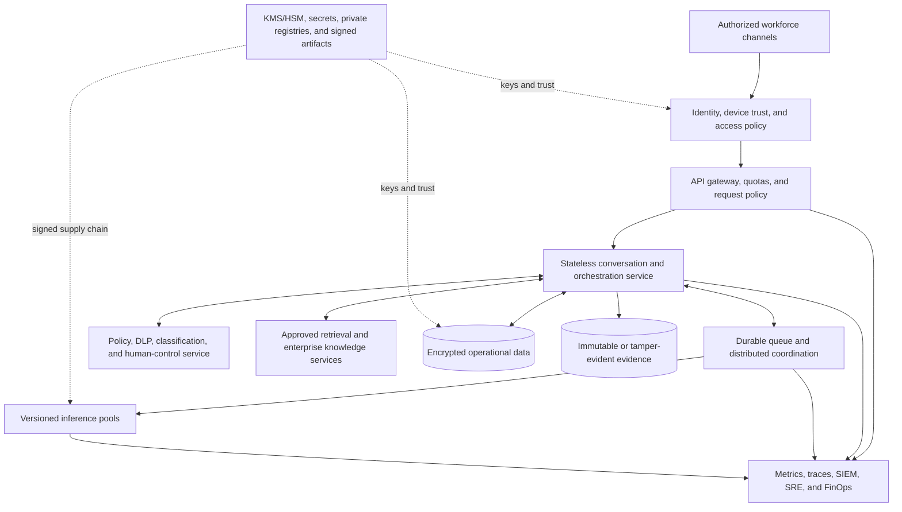

# Scalability and sovereignty

## Executive position

The current code is a single-user private-AI workstation. It is useful precisely because it creates a measurable starting point with a small blast radius. It must not be “scaled” by exposing the existing unauthenticated API or sharing its SQLite database.

Enterprise scale requires a different operating architecture around reusable product components. Sovereignty requires more than local inference: the organization must control data, identity, policy, keys, model artifacts, operations, jurisdiction, supply chain, resilience, and exit.

## Current capacity boundary

| Dimension | Current implementation | Consequence |
|---|---|---|
| Operating system | Windows AMD64 installer | Other platforms need a separately tested packaging path |
| User and tenant model | One local user; no application authentication | Do not expose beyond loopback |
| API scale | One FastAPI worker; conversation locks are process-local | Multiple workers can race and corrupt turn ordering |
| Persistence | Device-local SQLite with WAL | No shared tenancy, HA, central retention, or cross-node consistency |
| Inference | One llama.cpp process with `--parallel 1` | One generation slot and hardware-dependent latency |
| Model lifecycle | One pinned GGUF model and local manifest | No fleet rollout, canary, registry, or centralized revocation |
| Retrieval | Optional external search and bounded page fetch | No enterprise corpus, DLP, contractual source policy, or central egress gateway |
| Operations | Health endpoint and application logs | No metrics, tracing, SLO, SIEM, on-call, DR, or capacity telemetry |

This profile is intentionally honest: it is a pilot unit, not a small version of the final shared platform.

## Reusable foundations

The scale-out design can reuse:

- the React user experience and streaming API contract;
- clear model and search adapter boundaries;
- prompt separation for untrusted retrieved evidence;
- bounded retrieval and public-network destination checks;
- conversation and response schemas;
- pinned dependencies, model/runtime verification patterns, and installer-policy tests;
- offline-by-default semantics and explicit external-search modes;
- the governance artifacts and pilot evidence model in this repository.

The enterprise design should replace:

- device-only identity with enterprise OIDC and policy-based authorization;
- SQLite with a supported shared data service and explicit records controls;
- process-local locks with durable orchestration and idempotency;
- one embedded model process with managed inference pools and admission control;
- direct provider calls with policy-controlled egress and approved connectors;
- local logs with auditable, privacy-aware observability and evidence services.

## Target reference architecture



This is a reference pattern, not implemented infrastructure. Each adopter must select services that meet its jurisdiction, threat model, availability, and exit requirements.

## Deployment profiles

| Profile | Purpose | Required additions | Exit gate |
|---|---|---|---|
| **0. Developer workstation** | Engineering and synthetic-data testing | Current repository plus managed source control | Automated tests pass; no sensitive production data |
| **1. Controlled private pilot** | One user or tightly bounded cohort proving one workflow | Managed device, disk protection, approved data, named owners, egress decision, evaluation, support, incident and deletion procedure | Pilot scorecard meets scale thresholds |
| **2. Departmental service** | Shared, non-consequential internal workflow | SSO/RBAC, central encrypted persistence, approved retrieval, audit, retention, quotas, monitoring, backup/restore, support SLO | Load, recovery, isolation, security, privacy, and adoption evidence pass |
| **3. Regulated enterprise product** | Material workflow with formal assurance | Product funding, independent validation, model-risk process, DLP, policy engine, human approval, HA/DR, SIEM, change and release governance | Risk acceptance and all sector production gates pass |
| **4. Sovereign or air-gapped platform** | Jurisdiction- or mission-bound workloads | Jurisdiction-bound compute/storage/keys/operations, offline signed bundles, private registries, local dependencies, artifact provenance, operator-controlled portability and multi-site recovery | Independent sovereignty, resilience, and supply-chain assurance |

Moving to a later profile is a governance decision, not a configuration toggle.

## Scale design

### Stateless application tier

- Move user/session authority to signed identity tokens and server-side authorization.
- Make request handling idempotent with explicit request, turn, and correlation IDs.
- Persist state before acknowledging material events.
- Replace in-memory turn locks with durable per-conversation coordination.
- Support rolling deployment, graceful drain, rollback, and backward-compatible schemas.

### Data tier

- Use a supported shared relational service for conversations, ownership, policy state, and transactional metadata.
- Separate content, metadata, evidence, and operational telemetry by purpose and retention.
- Encrypt with organization-controlled keys and test key rotation, revocation, restoration, legal hold, export, and verified deletion.
- Enforce tenant and purpose boundaries in both application and data layers.
- Treat vector indexes and prompt caches as sensitive derived data, not disposable technical artifacts.

### Inference tier

- Separate model serving from API lifecycle.
- Create versioned pools by approved model, quantization, hardware class, and data zone.
- Add admission control, queue limits, cancellation, quotas, backpressure, and load shedding.
- Route only to approved model versions and record the route in decision evidence.
- Measure tokens, queue time, time to first token, generation rate, memory, energy, error, and task acceptance.
- Define canary, rollback, revocation, and model-retirement procedures.

### Retrieval tier

- Prefer approved enterprise sources with ownership, access checks, lineage, freshness, and deletion propagation.
- Perform authorization before retrieval and again before content is supplied to a model.
- Add content classification, DLP, malware/content controls, prompt-injection defenses, and source allow/deny policy.
- Route external search through a controlled egress service with contractual, privacy, logging, and residency review.
- Record source version, access decision, retrieval time, and evidence used for material outputs.

### Operations

- Define service level indicators before service level objectives: availability, latency, queue time, accepted-task quality, data-isolation failures, policy failures, and recovery.
- Send security and operational events to approved monitoring without copying unrestricted prompt content.
- Establish on-call ownership, severity, escalation, incident evidence, customer/user communication, and post-incident learning.
- Test backup restoration, regional/site failure, dependency loss, corrupt model artifacts, policy-service failure, and rollback.
- Track unit economics by accepted task, not only infrastructure utilization.

## Capacity and performance gate

Do not infer enterprise capacity from a successful local conversation. Establish a representative workload:

| Measure | Required evidence |
|---|---|
| Concurrent active users and arrival pattern | Observed or approved forecast by workflow |
| Input and output token distribution | P50/P95/P99 from sanitized representative tasks |
| Time to first token and completion | Percentiles under steady state and burst |
| Queue depth and abandonment | Normal, peak, dependency-degraded, and recovery behavior |
| Accepted-task quality | Human rubric by model/version and latency tier |
| Resource saturation | CPU/GPU, memory, disk, network, power, and thermal behavior |
| Failure and recovery | Error budget, retry amplification, cancellation, restart, and data consistency |
| Unit economics | Cost per attempted and accepted task at target utilization |

Use Little's Law only after arrival and service assumptions are understood:

```text
average concurrent work = arrival rate x average time in system
```

Then size for the approved percentile, failure reserve, maintenance reserve, and growth horizon. A faster model that reduces task acceptance can be more expensive than a slower model.

## Sovereignty decision model

| Sovereignty dimension | Leadership question | Evidence |
|---|---|---|
| Data | Who can read prompts, outputs, indexes, logs, backups, and derived data, and in which jurisdictions? | Data-flow, key, access, retention, residency, and deletion tests |
| Technology | Can the organization run, patch, inspect, and replace the stack without a mandatory external control plane? | Offline run, dependency map, portability and replacement test |
| Operations | Who administers, monitors, supports, and recovers the service? | Role model, privileged-access evidence, runbooks, recovery exercise |
| Legal and contractual | Which entities, laws, support paths, licenses, and government-access regimes apply? | Counsel/procurement assessment and current contracts |
| Supply chain | Can every model, binary, package, and update be traced, scanned, approved, revoked, and rebuilt? | SBOM, provenance, signatures, private registry, reproducible procedure |
| Economic | Can cost, capacity, and exit be controlled without unacceptable lock-in? | TCO, scenario sensitivity, committed-spend and exit plan |
| Mission | Can the service continue through provider, network, region, or geopolitical disruption? | Dependency-failure and continuity tests with approved RTO/RPO |

Local inference contributes to data and technology control. It does not answer the other dimensions automatically.

## Failure policy

For every dependency, choose and test one approved behavior:

- **fail closed:** reject the request when identity, policy, data authority, or required evidence is unavailable;
- **degrade safely:** offer a clearly labelled lower-risk capability, such as local drafting without retrieval;
- **queue:** retain a bounded, authorized request for later processing;
- **human route:** send the task to an approved manual process;
- **stop service:** when continued operation could create material harm or untraceable records.

Silent bypass is never an acceptable resilience strategy.

## Production roadmap

### Phase 1 - make the pilot defensible

- maintain offline-by-default behavior;
- add managed-device and approved-data procedures;
- execute quality, misuse, privacy, security, deletion, and recovery tests;
- establish actual workflow and unit-cost baselines;
- decide scale, revision, or stop.

### Phase 2 - build a shared control plane

- enterprise identity and authorization;
- central encrypted data and records controls;
- policy/DLP and human-approval integration;
- shared inference and retrieval services;
- durable queues, audit evidence, observability, backup/restore, and SRE ownership.

### Phase 3 - meet regulated product obligations

- context-specific independent validation and risk acceptance;
- sector controls, control testing, and regulatory/legal review;
- HA/DR, capacity certification, incident exercises, model/change governance, and third-party assurance;
- benefit realization and total-cost review.

### Phase 4 - prove sovereignty

- private, jurisdiction-bound artifact and operating supply chain;
- signed offline installation/update bundles and revocation;
- organization-controlled keys and privileged operations;
- multi-site continuity and tested technology/provider exit;
- periodic independent assurance against the approved sovereignty definition.

## Architecture decision

The current code should remain a clear workstation reference. Do not add distributed complexity until a pilot proves a workflow worth owning. When that evidence exists, treat the enterprise version as a funded product with its own threat model, data architecture, SLOs, validation, and accountable operating team.
